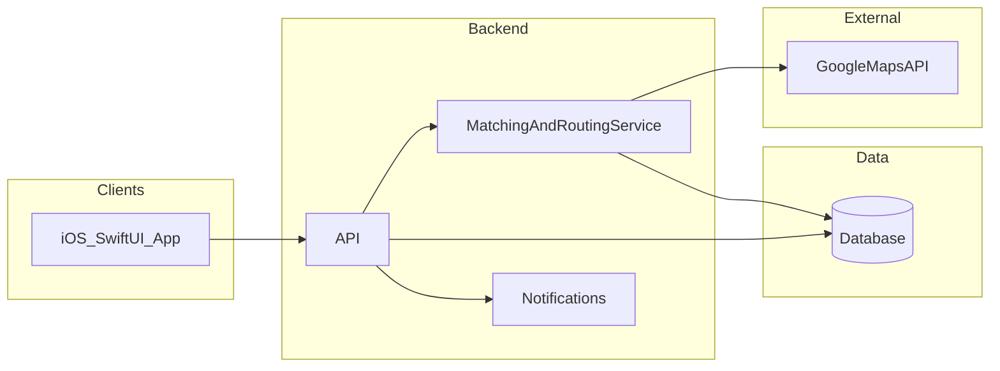

# City Daily Commute Carpool — Technical Specification

This document describes **how** we will implement the product defined in [carpool-city-01-product.md](./carpool-city-01-product.md). It should stay in sync with the product doc and drive [carpool-city-03-checklist.md](./carpool-city-03-checklist.md).

**Status:** Product rules are **set** for MVP. **Backend (decided):** **Node.js + TypeScript + [Fastify](https://fastify.dev/)**, hosted on **Railway** or **Render** with managed **PostgreSQL** — see §3.1. **Auth:** Firebase. Still configure: Google Cloud billing/keys for Maps.

---

## 1. References

- Product vision and MVP decisions: [carpool-city-01-product.md](./carpool-city-01-product.md)
- Implementation status: [carpool-city-03-checklist.md](./carpool-city-03-checklist.md)
- How to use these docs + checklist: [AGENT_INSTRUCTIONS.md](./AGENT_INSTRUCTIONS.md)

---

## 2. Technical goals

- **Driver intent first:** persist **DriverIntent** with **passenger seat capacity**; expose as **open for applications** until full.
- **Rider discovery:** `GET` (or `POST`) **match** endpoint: inputs **departure address**, **arrival address**, **wanted_arrival_at**, **date** → returns **open** `DriverIntent`s **ranked** by a **best-match** heuristic (corridor/ETA slack via Google APIs—MVP: simple scoring).
- **Rider applications:** users **POST applications** against a chosen **driver_intent_id**; **no driver accept/reject** in MVP—reject only on **system rules**: capacity, duplicates, **application cutoff** (**before start of departure calendar day** in the requesting user’s **device locale** / system time zone), etc.
- **Trigger:** When **number of accepted applications == passenger seat count**, invoke **MatchingAndRoutingService** **once** (or idempotently) to compute **ordered stops and times** such that each rider arrives **before** `wanted_arrival_at` (and driver reaches their declared destination if modeled).
- **Lifecycle** roughly: `collecting_passengers` → `full` → `routing` / `confirmed` (with stops) → `in_progress` → `completed` / `cancelled`. **No** `rejected_by_driver` in MVP.
- **Google Maps Platform** (Geocoding, Places optional, **Routes API** and/or legacy **Directions** / **Distance Matrix**) for **geocoding**, **routes**, and **ETAs** — see §14.
- **MVP:** morning-focused UX; **no payment**; **day-before** cancellation policy; **reopen** seats to new applications until **start of departure calendar day** (see §5: **device / system time zone** per user); if a **confirmed** ride loses a member, **invalidate route** and return to **collecting** until full, then **re-route**; **native iOS** SwiftUI client (§3).

---

## 3. Platform & stack

| Area | Decision / notes |
|------|------------------|
| **Client** | **iOS only (MVP):** **SwiftUI** app in Xcode. No requirement to ship Android or web for MVP. (Deployment target / OS support: use project defaults unless a constraint appears later.) |
| **Backend** | **Decided:** **Node.js + TypeScript + Fastify**. One HTTP service; run routing **inline** when the car fills (or a tiny in-process queue) for the demo. *(Express is an acceptable swap only if the team insists—same patterns.)* §3.1 |
| **Database** | **PostgreSQL** via host add-on (e.g. **Railway** / **Render**) for fastest path to a live URL + DB. |
| **Auth** | **Firebase Authentication** on iOS ([Firebase Auth](https://firebase.google.com/docs/auth)); backend verifies **`ID` token** (Firebase Admin SDK or JWT verify) and maps `uid` → `users` row. |
| **Maps & routing** | **Google Maps Platform** (REST): Geocoding, Places (optional), **Routes API** (**preferred** for new code: `computeRoutes`, `computeRouteMatrix`) and/or legacy **Directions** + **Distance Matrix**. See §14. Server-side keys; **do not** ship unrestricted keys in the app. |
| **Notifications** | **APNs** when application is recorded, when car becomes **full** and **route is ready**, and on cancel. |
| **Hosting** | **MVP default:** **[Railway](https://railway.app/)** or **[Render](https://render.com/)** — connect GitHub, add **PostgreSQL**, set env vars (`DATABASE_URL`, `GOOGLE_MAPS_KEY`, Firebase Admin JSON), get **HTTPS** for the iOS app in minutes. |

**Repo note:** [hackathon-app/hackathon-app](../hackathon-app/hackathon-app/) — SwiftUI shell.

### 3.1 MVP backend (decided): Node.js + TypeScript + Fastify

**Locked for this project** unless requirements change.

- **Fastify** — fast defaults, good TypeScript story via `@fastify/type-provider-typebox` or `zod`; aligns with a single-service MVP.
- **Firebase Admin** for Node is [well documented](https://firebase.google.com/docs/admin/setup); verifying ID tokens in middleware is a few lines.
- **Google Routes / Geocoding** are simple **`fetch`** calls from Node; no heavy SDK required.
- **PostgreSQL** via `pg` or **Prisma** (schema migrations for demo clarity).
- **Deploy:** Railway or Render gives you a **stable public base URL** for the SwiftUI app’s `API_BASE_URL` — critical for judges/users testing on real devices.
- **Hackathon speed:** largest pool of copy-paste examples; easy to add a `/health` for demos.

**Strong alternative: Python + FastAPI**

- Same hosting story; **Firebase Admin** and **HTTP client** for Google are equally easy. Choose this if the team is more comfortable in Python.

**When to consider Swift (Vapor) on the server**

- Only if you want **one language** end-to-end; Firebase Admin and Google REST from Swift are fine but **less tutorial-dense** — usually slower for an MVP demo unless the team already knows Vapor.

**Not recommended for this MVP:** jumping to **Kubernetes**, **microservices**, or **serverless split across many functions** before you have one working demo path.

---

## 4. High-level architecture



On each successful **application** `POST`, if `applications_count == capacity`, **enqueue or inline** route computation; persist results and notify participants.

---

## 5. Domain model (MVP-oriented)

| Entity | Purpose |
|--------|---------|
| **User** | Account, profile; can create **DriverIntent** and **RiderApplication** on different days. |
| **DriverIntent** | **Date**, driver **origin/destination** (exact addresses), **passenger_seats** (integer), **status** (e.g. open, full, confirmed, cancelled). |
| **RiderApplication** | **driver_intent_id**, **user_id**, **departure_address**, **arrival_address**, **wanted_arrival_at**; **created_at** for FCFS; unique (intent, user) for MVP. |
| **RideInstance** | Optional denormalized view: links **one driver intent** + **N applications** once **full**; holds **routing_status** and references **Stop** rows. |
| **Stop** | Ordered pickup/dropoff, user ref, lat/lng or place id, **scheduled time**. |

**Cancellation & reopen (product §8):** **Day-before** cancel rule for who may drop. On cancel: **decrement** applications; **reopen** seat. **New applications** allowed only while **current time is still before the start of the departure calendar day** in the **requesting user’s device locale** (system time zone), e.g. iOS `Calendar.current` / `TimeZone.current` semantics—**decided** for MVP. The API should carry the **same time zone** (e.g. IANA id from the client) so the **server** can enforce the cutoff consistently, not only the device UI. If ride was **confirmed** (stops persisted): **delete/clear stops**, set status back to **collecting_passengers** until **K** applications again, then **recompute route**. If cancel would violate day-before rule, **reject** the cancel API—align with product.

---

## 6. Matching & routing logic (MVP)

**Precondition:** `DriverIntent` has `passenger_seats = K`. There are **K** **RiderApplication** rows for this intent.

1. **Build participant set:** fixed list of K riders + driver waypoints.
2. **Feasibility:** Use **Google** travel times to find an ordering (heuristic) such that each rider’s **arrival-location dropoff** is before `wanted_arrival_at`, and driver still completes their trip if required.
3. **Persist** ordered **Stop** list + times; set intent/ride status **confirmed** (or `route_ready`).
4. **Notify** driver + all riders.

**Before full:** do **not** run full routing (product choice); UI shows **spots remaining** or similar.

**Application ordering:** Recommend **FCFS** by `created_at` when capacity is 1 remaining and multiple concurrent requests—use DB constraint or transaction to avoid overfill.

**Best-match ranking (pre-application):** MVP heuristic, e.g. combine **detour proxy** (extra distance/time vs driver’s baseline route), **slack** to `wanted_arrival_at`, and **seat availability**; exact formula **TBD**, keep **explainable** in UI later.

**Out of scope MVP:** driver approval, in-app payment, evening parity, perfect global optimization.

---

## 7. API surface (conceptual)

REST (or GraphQL) **TBD**; minimum resources:

- `POST/GET/PATCH` **auth**, **users**, **profiles**
- `POST/GET/DELETE` **driver_intents** (driver creates morning intent + capacity)
- `GET` **driver_intents/matches** (or `POST .../rank`) with **departure**, **arrival**, **wanted_arrival_at**, **date** → ranked **best-match** open intents
- `POST/GET/DELETE` **applications** (rider applies to an intent after choosing from list; delete = cancel if policy allows)
- `GET` **ride** or **driver_intent/:id/detail** for participants with **stops** once **confirmed**
- **No** `driver_response` accept/reject for MVP

---

## 8. Non-functional requirements

- **Privacy:** Exact addresses are **sensitive**; expose to **participants on the same ride** only after rules allow; avoid logging full addresses at info level.
- **Security:** Authenticated APIs, rate limits; prevent **double application** to same intent.
- **Reliability:** Capacity never exceeds K (transactional); routing job retries safe **idempotently**.
- **Observability:** Logs/metrics on fill events, Google API errors, routing failures.

---

## 9. Next steps (implementation)

1. Finalize **DriverIntent** required fields (driver home/work only—already required for routing).
2. Implement **application + capacity** enforcement and **fill-triggered** routing hook.
3. Integrate **Google Maps** (keys; **Routes API** `computeRoutes` / `computeRouteMatrix` where possible).
4. Ship **v1 router** (heuristic) + **v1 ranker** + iOS: create intent, rider enters trip → **best matches** → apply, progress until full, then route; **cutoff** and **cancel→reopen→re-route** behavior.
5. Align [carpool-city-03-checklist.md](./carpool-city-03-checklist.md) with shipped endpoints.

---

## 10. Time zone & API contract

Every **mutating** rider request (`POST /applications`, `POST /driver-intents/matches`, cancel) should include:

- `departure_date` — ISO **date** string `YYYY-MM-DD` for the commute (calendar day in the user’s intent).
- `client_time_zone` — IANA id, e.g. `Europe/Zagreb`, from `TimeZone.current.identifier` on iOS.

The server:

- Parses “start of `departure_date`” in that zone and rejects new **applications** if `now.utc` ≥ that instant (equivalently: no new riders once the departure **local** day has begun).
- Uses the same rule for **server-driven** jobs if the client omits refresh (prefer server UTC + stored `client_time_zone` on the session or last request).

**Day-before cancel:** Implement as: cancel allowed only if **server “today”** in `client_time_zone` is **strictly before** `departure_date` (or end of previous local day—match product prose exactly in code).

---

## 11. Relational schema (draft, PostgreSQL)

Naming is indicative; adjust to your ORM.

```text
users
  id (uuid, pk)
  email or phone (unique, nullable per auth choice)
  display_name, created_at

driver_intents
  id (uuid, pk)
  driver_user_id (fk users)
  departure_date (date)           -- calendar day of trip
  origin_address (text)
  destination_address (text)
  passenger_seats (int)           -- K passenger slots
  status (text)                   -- see §13
  created_at, updated_at

rider_applications
  id (uuid, pk)
  driver_intent_id (fk)
  rider_user_id (fk users)
  departure_address (text)
  arrival_address (text)
  wanted_arrival_at (timestamptz) -- deadline at destination
  client_time_zone (text)        -- snapshot at apply time
  created_at (timestamptz)
  UNIQUE (driver_intent_id, rider_user_id)

ride_stops
  id (uuid, pk)
  driver_intent_id (fk)
  sequence (int)
  kind (text)                     -- 'pickup' | 'dropoff'
  user_id (fk, nullable for driver-only legs if needed)
  place_label (text)
  latitude (double), longitude (double)
  scheduled_at (timestamptz)
```

**Indexes:** `(driver_intent_id)` on applications and stops; `(driver_user_id, departure_date)`; `(rider_user_id)`.

When **re-route** after dropout: **delete** `ride_stops` for that intent; reset `driver_intents.status` to `collecting_passengers` until applications count reaches K again.

---

## 12. REST API (MVP draft)

Base URL `/v1`. All JSON. Auth: `Authorization: Bearer <Firebase_ID_token>` — obtain with Firebase Auth on iOS, verify on each API request server-side.

**Common error codes:** `400` validation, `401` unauthenticated, `403` wrong user, `404`, `409` conflict (duplicate apply, over capacity, cutoff passed).

### Auth / user

- Sign-in / sign-up: **Firebase Auth** in the **iOS** app only for MVP (email, Apple, phone—whatever you enable in Firebase Console).
- Backend: verify token, upsert user by Firebase `uid`.
- `GET /me` → `{ id, displayName, email? }` (profile may mirror Firebase + app-specific fields).

### Driver intents

- `POST /driver-intents`  
  Body: `{ departureDate, originAddress, destinationAddress, passengerSeats, clientTimeZone }`  
  → `{ id, status, ... }`

- `GET /driver-intents/mine?from=&to=` — list current user’s intents.

- `DELETE /driver-intents/:id` — driver cancels intent if policy allows; cascades or blocks per product.

### Match (ranked discovery)

- `POST /driver-intents/matches`  
  Body: `{ departureDate, riderDepartureAddress, riderArrivalAddress, wantedArrivalAt (ISO8601), clientTimeZone }`  
  → `{ matches: [ { intentId, score, driverDisplayName, seatsRemaining, departureDate, ... } ] }`  
  Only intents with **status** `collecting_passengers` and **before cutoff** and `seatsRemaining > 0`.

### Applications

- `POST /driver-intents/:intentId/applications`  
  Body: `{ riderDepartureAddress, riderArrivalAddress, wantedArrivalAt, clientTimeZone }`  
  → `{ id, intentId, position?, seatsFilled, seatsTotal, status }`  
  If this application **fills** the car, response may include `routingStatus: "pending"` and async **push** when `confirmed`.

- `DELETE /applications/:id` — rider withdraws; same reopen/re-route rules as product §8.

### Ride detail

- `GET /driver-intents/:id/detail` — driver or accepted applicants only; includes `applications[]`, `stops[]` when `status >= confirmed`.

---

## 13. `driver_intents.status` state machine

Suggested string values:

| Status | Meaning |
|--------|---------|
| `collecting_passengers` | `applications.count < K`; no stops / stops cleared. |
| `full_routing` | Transient: `count == K`, worker computing route. |
| `confirmed` | Stops persisted; ready for trip day. |
| `cancelled` | Intent aborted. |

On **cancel** that drops count below K while `confirmed`: transition to `collecting_passengers`, **delete stops**.

---

## 14. Google Maps Platform usage

These are **paid, quota-based** APIs under [Google Maps Platform](https://developers.google.com/maps/documentation) (enable billing in Google Cloud). Official overview: [Maps Platform products](https://developers.google.com/maps/documentation).

### Routes API (yes — recommended for this project)

You **can** use the **[Routes API](https://developers.google.com/maps/documentation/routes)** as the primary server-side routing surface. It is Google’s **current** REST API family for:

- **`computeRoutes`** — one journey with origin, destination, and **intermediates** (waypoints), travel mode, polylines, per-leg duration/distance — use this for the **final carpool path** after stop order is chosen.
- **`computeRouteMatrix`** — many origins × many destinations in one request (within [documented limits](https://developers.google.com/maps/documentation/routes/route_matrix)) — use for **best-match** / **feasibility** scoring instead of or alongside **Distance Matrix API**.

**Decided for this spec:** Prefer **Routes API** for **new** backend code; fall back to **Directions API** / **Distance Matrix API** only if you hit a capability gap or need legacy behavior. All are called from the **backend** with a **restricted** server key.

### API cheat sheet

| Need | API (Google) | Typical use in this app |
|------|----------------|-------------------------|
| Address → coordinates | **Geocoding API** | Persist lat/lng; shared with routing. |
| Search / autocomplete | **Places API** (Autocomplete, Place Details, optional) | SwiftUI address fields; often a **separate** client key with iOS bundle restriction, or proxy via backend to hide key. |
| Pairwise travel time / distance | **Routes API** `computeRouteMatrix` **or** **Distance Matrix API** | Best-match **score**, feasibility between O/D pairs. |
| Single path through waypoints | **Routes API** `computeRoutes` **or** **Directions API** | Final pickup/dropoff order, leg durations, **encoded polyline** for the map. |
| Map view on device | **Maps SDK for iOS** *or* **MapKit** | SDK: Google map + overlays. MapKit: draw polyline from backend; **routing stays on server**. |

**Recommended MVP split:** **Backend** owns **Geocoding + Routes API** (and Places if needed), all with a **server** API key. **App:** Firebase Auth; **MapKit** or **Maps SDK for iOS** for display.

**Keys:** In [Google Cloud Console](https://console.cloud.google.com/) enable **Routes API**, **Geocoding API**, etc.; restrict keys (IP / bundle / referrer). Review [Routes API pricing](https://developers.google.com/maps/billing-and-pricing/pricing#routes) vs legacy products.

**Alternatives:** Apple MapKit for **display/search only**; routing still via Google on the server if you keep **Routes API**.

### 14.1 Routes API — implementation decisions (fill in after spike)

Complete the checklist **Investigation — Google Routes API** in [carpool-city-03-checklist.md](./carpool-city-03-checklist.md), then record here:

- Chosen **field masks** and request bodies (or links to internal examples).
- **Matrix:** which origin/destination pairs per match query; batching if intent list is large.
- **computeRoutes:** how **intermediates** map to carpool stops; traffic mode for MVP.
- **Quotas:** rough calls per user action for cost control during demos.

Until this subsection is filled, treat §15–§16 as **intent**; the spike may refine numbers and ordering.

---

## 15. Best-match score (v1 heuristic)

MVP formula (tune weights later):

- `score = w1 * normalized_time_slack + w2 * (1 - normalized_detour_proxy)`  
  Higher is **better**.

Where:

- **Time slack:** difference between feasible latest arrival and `wanted_arrival_at` if evaluating one rider vs driver route (approximate).
- **Detour proxy:** extra travel time vs driver driving alone (`computeRouteMatrix` or Distance Matrix)—lower is better.

**Filter** before scoring: drop intents where **seat count** is 0, **cutoff** passed, or **date** ≠ requested `departureDate`.

---

## 16. Router v1 (after car full)

1. Geocode all addresses if not already lat/lng.
2. **Order riders** for pickup/dropoff: MVP use **brute-force small K** (e.g. K ≤ 4) over permutations of pickups+dropoffs with validity checks, or **greedy nearest-neighbor** with repair passes.
3. For each candidate order, simulate leg times via **Routes API** `computeRoutes` (or **Directions**) / **Matrix** and check all `wanted_arrival_at`.
4. Pick **first feasible** or **lowest driver duration** among feasible; persist `ride_stops`.
5. If **no feasible order**: set intent to `collecting_passengers`, **remove last application** (FCFS rollback) or surface error to ops—**simplest MVP:** return `409` + message “could not schedule”; product may relax later.

---

## 17. iOS app structure (SwiftUI)

Suggested modules / folders inside the existing Xcode target:

| Area | Responsibility |
|------|----------------|
| **App** | `App` entry, dependency container. |
| **Auth** | Session token, login placeholder. |
| **API** | `URLSession`-based client, codable DTOs mirroring §12. |
| **Features/Drive** | Create intent form, my intents list. |
| **Features/Ride** | Match results list, application flow, trip detail map. |
| **DesignSystem** | Colors, typography, shared buttons. |

Use **`TimeZone.current.identifier`** on every request body that enforces calendar rules. Map: **`MapKit`** for MVP map chrome is acceptable if polylines come from backend or simplified client decode.

---

## 18. Checklist mapping

Implementation and verification live in [carpool-city-03-checklist.md](./carpool-city-03-checklist.md): **Shared**, **Backend**, **iOS**, and **End-to-end** sections map to §10–§17 here (and product doc flows). Mark items `[x]` only when **verified working**, not only when code is merged.
